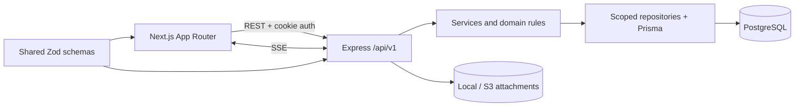

# Client Project Portal

A production-style, multi-tenant project operations portal for clients, project managers, engineers, and organization administrators. The MVP follows a requirement from client intake through triage, task delivery, comments, live updates, and client-visible progress.

## Status

Phase 2 is complete: the foundation, authentication, invitations, RBAC, CSRF protection, and centralized tenant scope are implemented. Client/project workflows begin in Phase 3; see `PROJECT_STATE.md`.

## Architecture



The backend is deliberately layered: route → controller → service → repository/Prisma → database. `organizationId` is the canonical tenancy key. See `docs/architecture.md` for boundaries and decisions.

## Local setup

Requirements: Node.js 22+, pnpm 11, Docker, and Docker Compose.

```bash
cp .env.example .env
pnpm install
pnpm db:generate
docker compose up postgres -d
pnpm db:migrate
pnpm db:seed
pnpm dev
```

PowerShell equivalent for the first command:

```powershell
Copy-Item .env.example .env
```

Alternatively, start the complete container stack with `docker compose up --build`.

## Environment variables

| Variable                  | Purpose                                     |
| ------------------------- | ------------------------------------------- |
| `DATABASE_URL`            | PostgreSQL connection used by Prisma        |
| `API_PORT`                | Express listen port; defaults to `4000`     |
| `WEB_ORIGIN`              | Allowed credentialed browser origin         |
| `NEXT_PUBLIC_API_URL`     | Browser-visible API base URL                |
| `JWT_SECRET`              | Access-token signing secret (phase 2)       |
| `CSRF_SECRET`             | CSRF-token secret (phase 2)                 |
| `JWT_EXPIRES_IN_SECONDS`  | Access-cookie lifetime; defaults to 8 hours |
| `COOKIE_SECURE`           | Secure-cookie override for local HTTP only  |
| `ATTACHMENT_STORAGE`      | `local` in development, `s3` in production  |
| `UPLOAD_DIRECTORY`        | Local attachment directory                  |
| `AWS_REGION`, `S3_BUCKET` | Production attachment storage settings      |

Never commit a populated `.env` file.

## Workspace commands

```bash
pnpm lint
pnpm typecheck
pnpm test
pnpm build
pnpm db:migrate
pnpm db:seed
```

## API overview

All endpoints use `/api/v1` and the standard error envelope.

| Method | Endpoint                 | Purpose                                            |
| ------ | ------------------------ | -------------------------------------------------- |
| GET    | `/health`                | Service health                                     |
| GET    | `/auth/csrf`             | Issue a signed double-submit CSRF token            |
| POST   | `/auth/register-org`     | Create an organization and its ADMIN               |
| POST   | `/auth/login`            | Authenticate and set the JWT cookie                |
| POST   | `/auth/logout`           | Clear authentication cookies                       |
| GET    | `/auth/me`               | Return the authenticated server-derived user scope |
| POST   | `/invites`               | Create an invitation; ADMIN only                   |
| POST   | `/invites/:token/accept` | Accept a one-time invitation                       |

State-changing requests require the CSRF token from `/auth/csrf` in the `x-csrf-token` header. Browser requests must include credentials. Remaining domain endpoints follow in later phases.

## Demo credentials

The seed creates these planned phase-2 accounts with password `DemoPass123!`:

| Role     | Email                 |
| -------- | --------------------- |
| ADMIN    | `admin@demo.local`    |
| PM       | `pm@demo.local`       |
| ENGINEER | `engineer@demo.local` |
| CLIENT   | `client@demo.local`   |

These accounts can sign in at `/login`.

## Demo workflow

The completed MVP will demonstrate: client submits requirement → PM reviews and approves → PM creates and assigns tasks → engineer starts and completes work → PM confirms delivery → client sees status and activity. The seed data includes two client accounts' data to support isolation testing.

## Deployment summary

Local development uses Docker Compose. The production target is ECS Fargate, RDS PostgreSQL, S3, an Application Load Balancer, and AWS-managed secrets. See `docs/deploy.md`.

## Tradeoffs and decisions

- Modular monolith over microservices: simpler transactions and deployment fit the MVP.
- SSE over WebSockets: the required realtime traffic is server-to-client.
- Global unique email: matches the source model and makes tenant discovery during login unnecessary.
- Local storage in development and S3 in production: one interface, environment-specific implementation.
- No speculative event bus or cache: PostgreSQL-backed workflows come first; scaling mechanisms will be added only if required.
