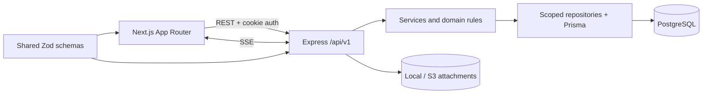

# Client Project Portal

A production-style, multi-tenant project operations portal for clients, project managers, engineers, and organization administrators. The MVP follows a requirement from client intake through triage, task delivery, comments, live updates, and client-visible progress.

## Status

Phase 8 is complete and verified locally with Docker Compose: every role now has a scoped delivery dashboard with project progress, requirement health, and recent activity, alongside consistent loading, empty, error-recovery, responsive, and not-found states. See `PROJECT_STATE.md`.

## Architecture



The backend is deliberately layered: route → controller → service → repository/Prisma → database. `organizationId` is the canonical tenancy key. See `docs/architecture.md` for boundaries and decisions.

## Local setup

Requirements: Node.js 22+, pnpm 11, Docker, and Docker Compose.

```bash
cp .env.example .env
pnpm install
pnpm db:generate
docker compose up postgres -d
pnpm db:migrate
pnpm db:seed
pnpm dev
```

PowerShell equivalent for the first command:

```powershell
Copy-Item .env.example .env
```

Alternatively, start the complete container stack with `docker compose up --build`.

## Environment variables

| Variable                  | Purpose                                     |
| ------------------------- | ------------------------------------------- |
| `DATABASE_URL`            | PostgreSQL connection used by Prisma        |
| `API_PORT`                | Express listen port; defaults to `4000`     |
| `WEB_ORIGIN`              | Allowed credentialed browser origin         |
| `NEXT_PUBLIC_API_URL`     | Browser-visible API base URL                |
| `JWT_SECRET`              | Access-token signing secret (phase 2)       |
| `CSRF_SECRET`             | CSRF-token secret (phase 2)                 |
| `JWT_EXPIRES_IN_SECONDS`  | Access-cookie lifetime; defaults to 8 hours |
| `COOKIE_SECURE`           | Secure-cookie override for local HTTP only  |
| `ATTACHMENT_STORAGE`      | Attachment adapter; currently `local`       |
| `UPLOAD_DIRECTORY`        | Local attachment directory                  |
| `AWS_REGION`, `S3_BUCKET` | Production attachment storage settings      |

Never commit a populated `.env` file.

## Workspace commands

```bash
pnpm lint
pnpm typecheck
pnpm test
pnpm build
pnpm db:migrate
pnpm db:seed
```

## API overview

All endpoints use `/api/v1` and the standard error envelope.

| Method    | Endpoint                       | Purpose                                            |
| --------- | ------------------------------ | -------------------------------------------------- |
| GET       | `/health`                      | Service health                                     |
| GET       | `/auth/csrf`                   | Issue a signed double-submit CSRF token            |
| POST      | `/auth/register-org`           | Create an organization and its ADMIN               |
| POST      | `/auth/login`                  | Authenticate and set the JWT cookie                |
| POST      | `/auth/logout`                 | Clear authentication cookies                       |
| GET       | `/auth/me`                     | Return the authenticated server-derived user scope |
| POST      | `/invites`                     | Create an invitation; ADMIN only                   |
| POST      | `/invites/:token/accept`       | Accept a one-time invitation                       |
| GET/POST  | `/clients`                     | List scoped clients or create one (ADMIN/PM)       |
| GET/POST  | `/projects`                    | List scoped projects or create one (ADMIN/PM)      |
| GET       | `/projects/:id`                | Read a tenant- and client-scoped project           |
| GET/POST  | `/projects/:id/requirements`   | List requirements or submit one (CLIENT)           |
| GET/PATCH | `/requirements/:id`            | Read or edit eligible submitted content            |
| POST      | `/requirements/:id/transition` | Apply a validated PM triage transition             |
| GET       | `/requirements/:id/activity`   | Read paginated, tenant-scoped requirement activity |
| GET/POST  | `/requirements/:id/tasks`      | List scoped tasks or create a PM task breakdown    |
| GET       | `/tasks`                       | List the PM/ENGINEER task board with filters       |
| GET       | `/tasks/assignees`             | List organization engineers for PM assignment      |
| PATCH     | `/tasks/:id`                   | Edit a `TODO` task as PM                           |
| POST      | `/tasks/:id/move`              | Apply the next validated task status               |
| GET/POST  | `/requirements/:id/comments`   | List or create scoped requirement comments         |
| GET/POST  | `/tasks/:id/comments`          | List or create scoped task comments                |
| GET       | `/notifications`               | List paginated notifications for the current user  |
| POST      | `/notifications/:id/read`      | Idempotently mark a scoped notification as read    |
| GET       | `/events`                      | Open the authenticated, user-filtered SSE stream   |
| GET       | `/dashboard`                   | Read role-aware, tenant-scoped delivery metrics    |

State-changing requests require the CSRF token from `/auth/csrf` in the `x-csrf-token` header. Browser requests must include credentials. Requirement creation accepts `multipart/form-data` with an optional `attachment` field; supported files are PDF, Word, text, PNG, and JPEG up to 10 MB.

## Demo credentials

The seed creates these planned phase-2 accounts with password `DemoPass123!`:

| Role     | Email                 |
| -------- | --------------------- |
| ADMIN    | `admin@demo.local`    |
| PM       | `pm@demo.local`       |
| ENGINEER | `engineer@demo.local` |
| CLIENT   | `client@demo.local`   |

These accounts can sign in at `/login`.

## Demo workflow

1. Sign in as the CLIENT, review the scoped portfolio dashboard, and submit a requirement from one of its projects.
2. Sign in as the PM, open the requirement, move it into review, and approve it.
3. On the approved requirement, create one or more tasks with an engineer, estimate, and due date.
4. Sign in as the ENGINEER, open `/board`, and move each assigned task through `TODO`, `IN_PROGRESS`, `IN_REVIEW`, and `DONE`.
5. Sign back in as the PM and confirm delivery after all tasks are done.
6. Use requirement and task discussions for internal delivery notes or client-visible updates and one-level replies.
7. Keep the CLIENT session open to see the notification bell update when client-visible comments and workflow statuses change, then open the delivered requirement to see its task summary and activity timeline.

The current workflow supports: ADMIN/PM creates a client and project → ADMIN invites a client user → CLIENT submits a requirement with an optional attachment → PM reviews and approves or rejects it → PM creates an assigned task breakdown → ENGINEER advances assigned tasks on the board → CLIENT and delivery teams collaborate through visibility-controlled discussions → PM confirms delivery once all work is done → CLIENT receives live, client-safe notifications and sees progress and activity history. The seed data includes two client accounts to support isolation testing.

## Deployment summary

Local development uses Docker Compose. The production target is ECS Fargate, RDS PostgreSQL, S3, an Application Load Balancer, and AWS-managed secrets. See `docs/deploy.md`.

## Tradeoffs and decisions

- Modular monolith over microservices: simpler transactions and deployment fit the MVP.
- SSE over WebSockets: the required realtime traffic is server-to-client.
- Global unique email: matches the source model and makes tenant discovery during login unnecessary.
- Local storage is implemented behind an attachment-storage interface for development and Compose. The S3 adapter is bound during the deployment phase without changing requirement services.
- Request-information and rejection transitions require a reason and expose it in the activity timeline. This keeps client follow-up actionable; only rejection also persists the reason on the requirement itself.
- Task status changes are forward-only and use a native dropdown on the board. This provides the brief's required status-change workflow with dependable keyboard access and without adding a drag-and-drop dependency.
- Task creation requires a UUID idempotency key and is unique within an organization, preventing duplicate tasks from retries or double submissions.
- Threaded-lite comments allow one reply level and keep the parent's visibility. Comments are immutable in the MVP because edit/delete endpoints are outside the brief.
- Internal comments are filtered from both comment responses and client activity responses, preventing the audit trail from disclosing that a hidden discussion exists.
- Notifications are durable PostgreSQL rows created transactionally with the originating mutation. Delivery targets the owning client, relevant assignees, and organization delivery roles while excluding the actor; internal comments never produce client notifications.
- SSE polls recipient-specific notification rows once per second and acts only as a TanStack Query invalidation signal. Historical unread items come from the notification API, and no speculative event bus or duplicate client state is introduced.
- The dashboard uses one role-aware read model instead of separate role-specific APIs. Clients see only their client portfolio and client-safe activity, engineers see only assigned delivery work, and PM/ADMIN users see organization-wide delivery health.
