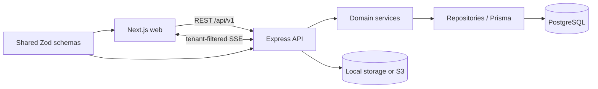

# Architecture

## System shape

The portal is a pnpm workspace and a modular monolith. The browser application, API, and shared validation package are deployed separately but versioned together.

Backend requests follow `route -> controller -> service -> repository / Prisma -> database`. Routes map URLs and middleware only. Controllers translate HTTP inputs and outputs. Services own business rules and transaction boundaries. Repositories apply authenticated scope before querying Prisma.

## Tenancy and authorization boundary

Every organization-owned model stores `organizationId`. Authenticated scope will contain `organizationId`, role, and optional `clientId`; request bodies cannot override it. Phase 2 introduces central authentication, role authorization, and scoped data-access helpers before any protected resource endpoints are added. CLIENT access will add a mandatory `clientId` filter, and SSE subscriptions will use the same scope.

## Decisions and assumptions

- `PROJECT_BRIEF.md` is the canonical specification; the initially supplied `client-portal-brief.md` was renamed without changing its requirements.
- PostgreSQL 17 is used locally. Production will use a supported RDS PostgreSQL release.
- IDs are CUID strings. They are opaque to clients and do not replace authorization checks.
- User email is globally unique, matching the starting model in the brief. This keeps login unambiguous for the MVP.
- Comments support one optional parent, which provides the requested threaded-lite behavior without arbitrary discussion-tree features.
- Development attachments default to a local `uploads` directory. Production uses S3 through a storage adapter introduced with attachments.
- The initial web shell uses system fallbacks for the selected Plus Jakarta Sans aesthetic so builds do not depend on a font CDN. A self-hosted font may be added during UI polish if justified.
- The UI direction is a restrained light B2B interface: high contrast, compact information density, visible keyboard focus, and reduced-motion support.

## Reliability model

Multi-record mutations use Prisma transactions. Side-effecting workflows will accept or derive idempotency keys where retries can duplicate work. Activity entries are written in the same transaction as their mutations. Requirement transitions live in domain services and are tested independently.
