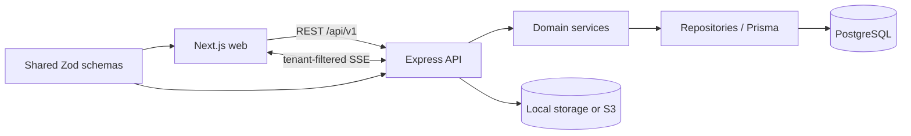

# Architecture

## System shape

The portal is a pnpm workspace and a modular monolith. The browser application, API, and shared validation package are deployed separately but versioned together.

Backend requests follow `route -> controller -> service -> repository / Prisma -> database`. Routes map URLs and middleware only. Controllers translate HTTP inputs and outputs. Services own business rules and transaction boundaries. Repositories apply authenticated scope before querying Prisma.

## Authentication, tenancy, and authorization boundary

Every organization-owned model stores `organizationId`. The JWT stores only the user ID. Authentication middleware reloads the user and derives `organizationId`, role, and optional `clientId` from the database on every protected request; request bodies cannot override that scope.

Central role middleware rejects unauthorized actions before business data access. Tenant policy helpers and scoped repository filters return not-found errors for out-of-scope records to avoid leaking their existence. CLIENT project and requirement queries always add the authenticated `clientId`; arbitrary organization, client, project, and requirement IDs are never trusted. SSE subscriptions use the same authenticated database-backed scope and stream only notifications addressed to the current user.

The access JWT is stored in an `httpOnly`, `SameSite=Lax` cookie. State-changing requests use a signed double-submit CSRF cookie and matching `x-csrf-token` header. Auth endpoints are rate-limited. Invitation tokens are random, returned only in the generated invite link, and stored as SHA-256 hashes. Acceptance claims an invite and creates its user in one transaction.

## Decisions and assumptions

- `PROJECT_BRIEF.md` is the canonical specification; the initially supplied `client-portal-brief.md` was renamed without changing its requirements.
- PostgreSQL 17 is used locally. Production will use a supported RDS PostgreSQL release.
- IDs are CUID strings. They are opaque to clients and do not replace authorization checks.
- User email is globally unique, matching the starting model in the brief. This keeps login unambiguous for the MVP.
- Comments support one optional parent, which provides the requested threaded-lite behavior without arbitrary discussion-tree features.
- Phase 3 attachments use a local `uploads` directory through an attachment-storage interface. Files are limited to 10 MB and an allowlist of common business formats, receive random storage keys, and are removed if the database transaction fails. The deployment phase provides the S3 implementation.
- ADMIN and PM users may create clients and projects. CLIENT users submit requirements only to projects belonging to their authenticated client account. Requirement content can be edited by its submitting client while `SUBMITTED` or `NEEDS_INFO`; status changes are reserved for the Phase 4 transition service.
- PM triage allows only `SUBMITTED -> IN_REVIEW`, `IN_REVIEW -> NEEDS_INFO | APPROVED | REJECTED`, and `NEEDS_INFO -> IN_REVIEW`. `NEEDS_INFO` and `REJECTED` require a client-visible reason. `APPROVED -> IN_PROGRESS` remains automatic when Phase 5 starts the first task, and delivery remains a separate PM confirmation after all tasks are done.
- PMs create the complete task breakdown while a requirement is `APPROVED`. New task requests require a UUID idempotency key, enforced by a composite organization/key uniqueness constraint, so a retry returns the original task instead of duplicating work. PMs may edit task details only while the task remains `TODO`.
- Task movement is deliberately forward-only: `TODO -> IN_PROGRESS -> IN_REVIEW -> DONE`. Engineers can list and move only tasks assigned to their authenticated user; PMs can view and move all tasks in their organization. The board uses an accessible status dropdown rather than drag-and-drop so keyboard and touch workflows remain reliable without an additional interaction library.
- Starting the first task atomically changes its approved requirement to `IN_PROGRESS`. `IN_PROGRESS -> DELIVERED` is a PM-only confirmation and is rejected until the requirement has at least one task and every task is `DONE`.
- Comments belong to exactly one requirement or task. Threaded-lite means a comment may reference one root parent, but replies cannot themselves receive replies. A reply must keep its parent's visibility so a thread cannot cross the internal/client boundary.
- ADMIN and PM users may comment on organization-scoped requirements and tasks. Engineers may comment only on assigned tasks and the requirements containing those assignments. Clients may comment only within their authenticated client's projects and can create and read only `CLIENT_VISIBLE` comments. Client activity queries also remove activity for internal comments so the audit feed cannot reveal hidden discussions.
- Comments are immutable in the MVP because the brief defines list/create endpoints only. This also keeps their associated activity entries meaningful without adding edit or deletion audit semantics.
- Requirement status changes, task status changes, and new comments create recipient-specific notifications in the same database transaction as the originating mutation. The actor is excluded. ADMIN and PM users receive organization workflow events; CLIENT users receive only events for their client and never for internal comments; ENGINEER users receive only events for requirements or tasks assigned to them.
- SSE uses a simple one-second PostgreSQL poll over persisted notification rows, plus a heartbeat every 15 seconds. A stream begins at connection time; existing unread items are loaded through the paginated notification API. This avoids an extra event-broker dependency, works across multiple API instances, and preserves per-user tenant filtering for the MVP.
- The browser treats SSE as an invalidation signal for TanStack Query rather than a second application-state store. Status, board, discussion, requirement, and notification queries refetch through their normal authorized APIs.
- The dashboard is a read model over projects, requirements, tasks, and requirement activity. ADMIN and PM users receive organization-scoped delivery health; CLIENT users receive only their authenticated client portfolio with internal comment activity removed; ENGINEER users receive only projects, requirements, tasks, and activity connected to their own assignments. The endpoint derives every scope from the authenticated session and accepts no tenant identifiers.
- Dashboard aggregation intentionally remains inside the modular monolith and uses scoped Prisma relation filters. This keeps the MVP transaction and authorization model simple; a separate analytics store would add operational complexity without a current requirement.
- The initial web shell uses system fallbacks for the selected Plus Jakarta Sans aesthetic so builds do not depend on a font CDN. A self-hosted font may be added during UI polish if justified.
- The UI direction is a restrained light B2B interface: high contrast, compact information density, visible keyboard focus, and reduced-motion support.
- Authentication cookies are `httpOnly`, `SameSite=Lax`, and secure by default in production. Local HTTP Compose explicitly sets `COOKIE_SECURE=false`; deployed environments must not use that override.
- Invitation delivery is manual for the MVP: the API and ADMIN dashboard display the invite link instead of sending email.

## Reliability model

Multi-record mutations use Prisma transactions. Activity entries and applicable notification rows are written in the same transaction as client, project, requirement, task, and comment mutations. Requirement and task transitions use expected-current-status updates so concurrent requests cannot apply the same transition twice. The first task start and automatic requirement start are committed together. Local attachment writes are compensated if requirement persistence fails. Task creation uses a tenant-scoped idempotency key. Marking a notification read is idempotent and preserves the original read timestamp on retries. Transition, comment visibility, and notification-recipient rules are tested independently.
