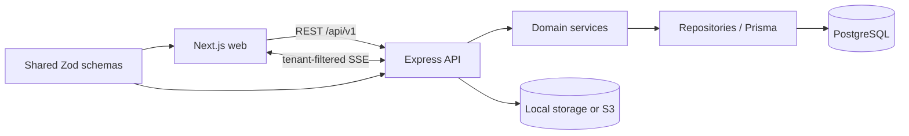

# Architecture

## System shape

The portal is a pnpm workspace and a modular monolith. The browser application, API, and shared validation package are deployed separately but versioned together.

Backend requests follow `route -> controller -> service -> repository / Prisma -> database`. Routes map URLs and middleware only. Controllers translate HTTP inputs and outputs. Services own business rules and transaction boundaries. Repositories apply authenticated scope before querying Prisma.

## Authentication, tenancy, and authorization boundary

Every organization-owned model stores `organizationId`. The JWT stores only the user ID. Authentication middleware reloads the user and derives `organizationId`, role, and optional `clientId` from the database on every protected request; request bodies cannot override that scope.

Central role middleware rejects unauthorized actions before business data access. Tenant policy helpers return not-found errors for out-of-scope records to avoid leaking their existence. CLIENT access always adds its authenticated `clientId`; repositories introduced in later phases must apply these helpers before querying Prisma. SSE subscriptions will use the same authenticated scope.

The access JWT is stored in an `httpOnly`, `SameSite=Lax` cookie. State-changing requests use a signed double-submit CSRF cookie and matching `x-csrf-token` header. Auth endpoints are rate-limited. Invitation tokens are random, returned only in the generated invite link, and stored as SHA-256 hashes. Acceptance claims an invite and creates its user in one transaction.

## Decisions and assumptions

- `PROJECT_BRIEF.md` is the canonical specification; the initially supplied `client-portal-brief.md` was renamed without changing its requirements.
- PostgreSQL 17 is used locally. Production will use a supported RDS PostgreSQL release.
- IDs are CUID strings. They are opaque to clients and do not replace authorization checks.
- User email is globally unique, matching the starting model in the brief. This keeps login unambiguous for the MVP.
- Comments support one optional parent, which provides the requested threaded-lite behavior without arbitrary discussion-tree features.
- Development attachments default to a local `uploads` directory. Production uses S3 through a storage adapter introduced with attachments.
- The initial web shell uses system fallbacks for the selected Plus Jakarta Sans aesthetic so builds do not depend on a font CDN. A self-hosted font may be added during UI polish if justified.
- The UI direction is a restrained light B2B interface: high contrast, compact information density, visible keyboard focus, and reduced-motion support.
- Authentication cookies are `httpOnly`, `SameSite=Lax`, and secure by default in production. Local HTTP Compose explicitly sets `COOKIE_SECURE=false`; deployed environments must not use that override.
- Invitation delivery is manual for the MVP: the API and ADMIN dashboard display the invite link instead of sending email.

## Reliability model

Multi-record mutations use Prisma transactions. Side-effecting workflows will accept or derive idempotency keys where retries can duplicate work. Activity entries are written in the same transaction as their mutations. Requirement transitions live in domain services and are tested independently.
